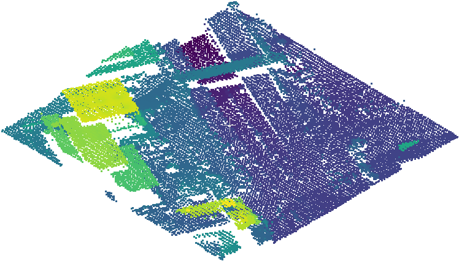
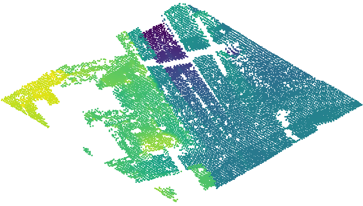

# ASI
adaptive surface interpolation filter

## Usage
This binary needs to be run on a Windows system using the command.

Command: `asi.exe filename(str) h(float) t(float) st(bool)`
- filename (string): point cloud filename (.txt file with "x y z" )
- h (float): initial grid resolution (m)
- t (float): initial residual threshold (m)
- st (bool): slope post-processing factor

## Example
Command: `asi.exe samp22_ro.txt 2 0.2 True`

Original Point Cloud:

Filtered Ground Points:
